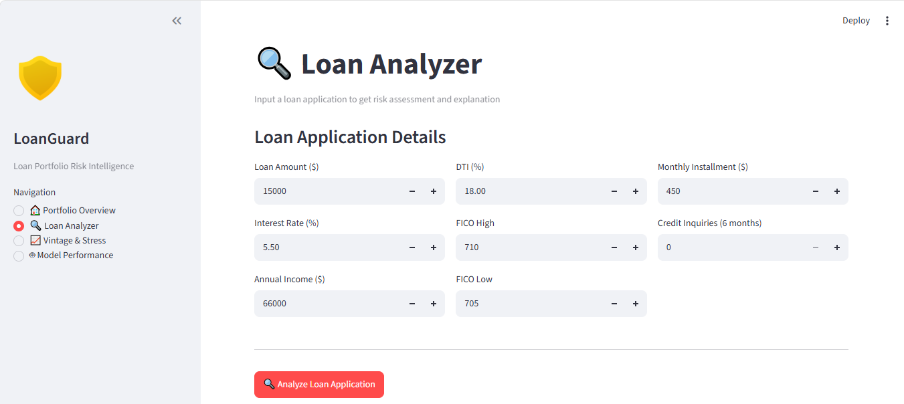
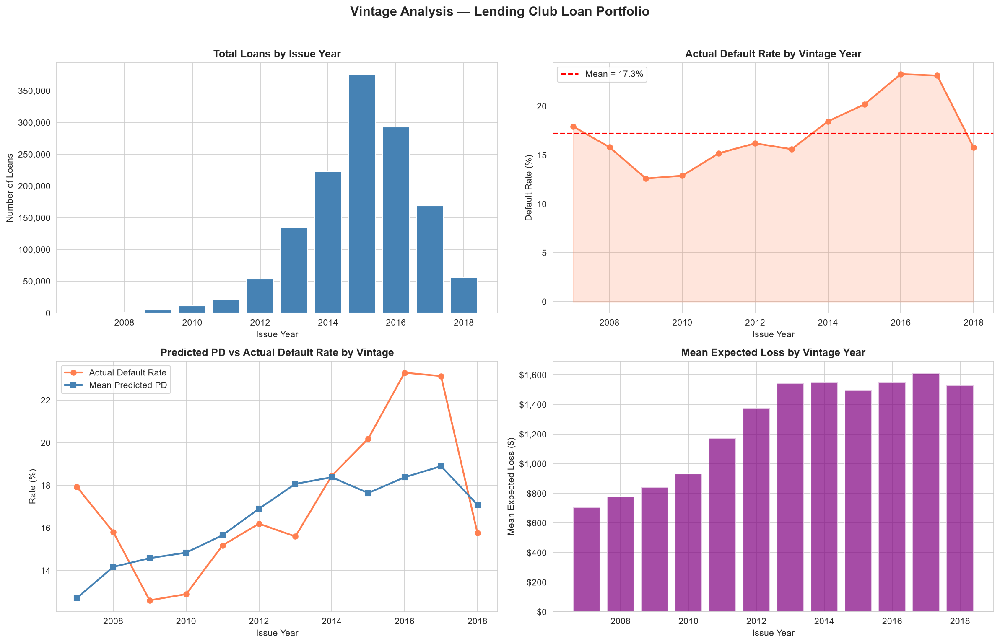
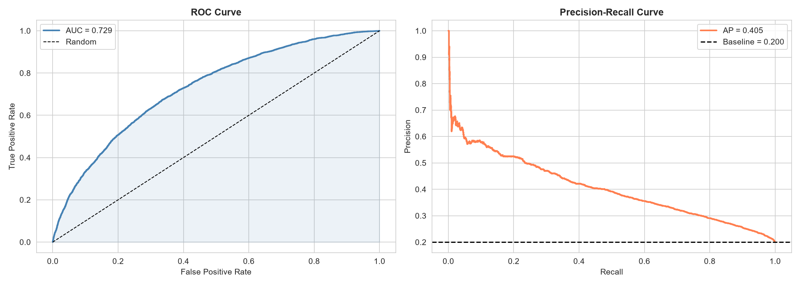

# 🛡️ LoanGuard — Loan Portfolio Risk Intelligence System

> **End-to-end credit risk platform** that predicts loan default probability, calculates expected loss, optimises pricing, and generates AI-powered credit memos — all grounded in real Lending Club data (2007–2018).

---

## 📸 Screenshots

> _Add screenshots of your Streamlit dashboard here. Replace the placeholders below with actual images from the running app._

| Portfolio Overview | Loan Analyzer |
|---|---|
|  |  |

| Vintage & Stress Testing | Model Performance |
|---|---|
|  |  |

> 💡 **How to add your own screenshots:** Run the Streamlit app (`streamlit run dashboard/app.py`), take screenshots of each tab, save them in `notebooks/images/`, and update the paths above.

---

## 🎯 What This Project Does

LoanGuard is a **production-grade credit risk intelligence system** that covers the full risk management lifecycle:

1. **Probability of Default (PD)** — LightGBM model trained on 1M+ Lending Club loans, AUC-ROC 0.729, Gini 0.458
2. **Loss Given Default (LGD)** — Estimated via regression on historical recovery rates
3. **Exposure at Default (EAD)** — Calibrated from portfolio data
4. **Expected Loss (EL)** — Basel framework: `EL = PD × LGD × EAD`
5. **Pricing Optimisation** — LP-based minimum interest rate to ensure profitability
6. **Vintage & Stress Testing** — Cohort analysis + macro-shock scenario modelling
7. **SHAP Explainability** — Shapley values for each prediction
8. **AI Credit Memos** — Claude Sonnet-powered adverse action notices grounded in SHAP attributions

---

## 🏗️ Project Architecture

```
loan-portfolio-risk-intelligence-system/
│
├── 📓 notebooks/                   # Research & analysis notebooks
│   ├── 01_eda.ipynb                # Exploratory data analysis
│   ├── 02_feature_engineering.ipynb
│   ├── 03_pd_model.ipynb           # PD model training (LightGBM)
│   ├── 03b_model_comparison.ipynb  # LR vs RF vs XGB vs LightGBM
│   ├── 04_lgd_ead_model.ipynb      # LGD & EAD modelling
│   ├── 05_pricing_optimization.ipynb # LP pricing optimisation
│   ├── 06_vintage_stress.ipynb     # Vintage cohorts & stress tests
│   ├── 07_shap_llm.ipynb           # SHAP + Claude credit memos
│   └── images/                     # All generated plots (24 figures)
│
├── 🧠 src/                         # Core Python modules
│   ├── predict.py                  # PD prediction, EL, scoring
│   ├── explain.py                  # SHAP explainability
│   ├── features.py                 # Feature engineering pipeline
│   └── llm_memo.py                 # Claude AI credit memo generator
│
├── 🖥️ dashboard/
│   └── app.py                      # Streamlit multi-tab dashboard
│
├── ⚡ api/
│   ├── main.py                     # FastAPI REST endpoints
│   └── Dockerfile                  # Container deployment
│
├── 🤖 models/                      # Serialised model artifacts
│   ├── pd_model.txt                # LightGBM PD model
│   ├── lgd_model.txt               # LightGBM LGD model
│   ├── feature_cols.json           # Feature list
│   ├── ead_ratio.json
│   ├── shap_expected_value.json
│   └── optimization_summary.json
│
├── 📊 data/                        # Data files (gitignored if large)
│   ├── accepted_2007_to_2018Q4.csv.gz
│   ├── rejected_2007_to_2018Q4.csv.gz
│   ├── df_model.csv
│   ├── df_model_with_el.csv
│   ├── df_model_with_pricing.csv
│   ├── stress_test_results.csv
│   ├── vintage_analysis.csv
│   └── shap_values.csv
│
├── requirements.txt
└── .env                            # API keys (not committed)
```

---

## 📊 Model Performance

| Metric | Value |
|--------|-------|
| **AUC-ROC** | 0.729 |
| **Gini** | 0.458 |
| **KS Statistic** | 0.338 |
| **Average Precision** | 0.405 |

### Why LightGBM?

| Factor | Logistic Regression | Random Forest | XGBoost | **LightGBM** |
|--------|--------------------:|-------------:|--------:|-------------:|
| Gini | ~0.38 | ~0.42 | ~0.44 | **0.458** |
| Speed | Fast | Slow | Medium | **Fastest** |
| SHAP | Linear only | Approximate | Exact | **Exact** |
| Missing values | Manual | Manual | Native | **Native** |

LightGBM's leaf-wise tree growth captures complex non-linear feature interactions missed by logistic regression, while being 3–5× faster than XGBoost on tabular data. Native SHAP support enables exact Shapley value computation — essential for the regulatory explanation layer.

---

## 🚀 Quick Start

### 1. Clone & install dependencies

```bash
git clone https://github.com/your-username/loan-portfolio-risk-intelligence-system.git
cd loan-portfolio-risk-intelligence-system

python -m venv venv
# Windows
venv\Scripts\activate
# Mac/Linux
source venv/bin/activate

pip install -r requirements.txt
```

### 2. Set up environment variables

Create a `.env` file in the project root:

```env
ANTHROPIC_API_KEY=your_anthropic_api_key_here
```

> Get your Claude API key at [console.anthropic.com](https://console.anthropic.com)

### 3. Run the notebooks (in order)

```bash
jupyter notebook
```

Execute notebooks `01` → `07` in sequence to generate all model artifacts and data files.

### 4. Launch the Streamlit dashboard

```bash
streamlit run dashboard/app.py
```

Navigate to `http://localhost:8501`

### 5. (Optional) Start the FastAPI server

```bash
uvicorn api.main:app --reload
```

API docs available at `http://localhost:8000/docs`

---

## 🖥️ Dashboard Tabs

### 🏠 Portfolio Overview
- **KPI Metrics** — Total loans, default rate, mean expected loss, % underpriced loans
- **Default Rate by Loan Grade** — Bar chart across grades A–G
- **Default Rate by Vintage Year** — Time-series trend line
- **Expected Loss Distribution** — Histogram of EL amounts
- **Rate Adequacy Distribution** — Actual vs minimum required rate spread

### 🔍 Loan Analyzer
Input any loan application details and instantly get:
- **Default Probability** (%) + Credit Score (300–850)
- **Expected Loss** ($) + Minimum Required Rate (%)
- **Approve/Deny Decision** with risk label (LOW / MEDIUM / HIGH / VERY HIGH)
- **SHAP Waterfall Chart** — Visual explanation of the top risk drivers
- **AI Credit Memo** — Claude-generated adverse action notice with:
  - Plain-language denial reasons
  - Analyst technical notes (grounded in SHAP values)
  - Actionable recommendations for the applicant

### 📈 Vintage & Stress Testing
- **Vintage Analysis** — Actual vs predicted default rate by issue year cohort
- **Loan Volume** by vintage year
- **Stress Test Results** — Expected loss under Baseline, Mild Recession, and Severe Recession scenarios
- **Capital Threshold** — 5% EL/Portfolio benchmark visualisation

### 🤖 Model Performance
- **ROC & Precision-Recall Curves**
- **Model Comparison** — Benchmarks across Logistic Regression, Random Forest, XGBoost, LightGBM, CatBoost
- **SHAP Feature Importance** — Global feature rankings
- **SHAP Summary Plot** — Distribution of SHAP values per feature

---

## ⚡ REST API

The FastAPI service exposes two primary endpoints:

### `POST /predict`

Predict default probability and expected loss for a loan application.

**Request body:**
```json
{
  "int_rate": 13.0,
  "loan_amnt": 15000,
  "annual_inc": 65000,
  "dti": 18.0,
  "fico_range_high": 710,
  "fico_range_low": 705,
  "installment": 450,
  "inq_last_6mths": 1
}
```

**Response:**
```json
{
  "pd": 0.1423,
  "pd_pct": 14.23,
  "risk_label": "MEDIUM",
  "credit_score": 672,
  "expected_loss": 1234.56,
  "expected_loss_pct": 8.23,
  "min_rate": 11.47,
  "actual_rate": 13.0,
  "is_underpriced": false,
  "decision": "APPROVE"
}
```

### `POST /explain`

Generate SHAP explanation + Claude AI credit memo.

**Response includes:** `pd`, `risk_label`, `top_drivers` (SHAP), `credit_memo` (adverse action notice, reasons, analyst notes, recommendation)

### `GET /health`

```json
{"status": "healthy", "models_loaded": true}
```

---

## 🧮 Risk Metrics Explained

| Metric | Formula | Description |
|--------|---------|-------------|
| **PD** | Model output | Probability a borrower defaults within 2 years |
| **LGD** | Mean = 62% | Fraction of EAD lost if default occurs |
| **EAD** | `Loan × EAD ratio` | Outstanding balance at time of default |
| **EL** | `PD × LGD × EAD` | Expected Loss (Basel III framework) |
| **Min Rate** | `CoF + EL% + OpEx + Margin` | Break-even interest rate |
| **Credit Score** | `600 + PDO × log(odds)` | Scaled 300–850, higher = lower risk |

---

## 📓 Notebook Walkthrough

| # | Notebook | What It Covers |
|---|----------|---------------|
| 01 | `01_eda.ipynb` | Dataset overview, default rates by grade/purpose/DTI, feature distributions, information value |
| 02 | `02_feature_engineering.ipynb` | Feature selection, ratio features (`loan_to_income`, `installment_to_income`), target encoding |
| 03 | `03_pd_model.ipynb` | LightGBM PD model training, hyperparameter tuning, AUC/Gini/KS evaluation, score distribution |
| 03b | `03b_model_comparison.ipynb` | Side-by-side benchmark: LR, RF, XGB, LightGBM, CatBoost |
| 04 | `04_lgd_ead_model.ipynb` | LGD regression model, EAD ratio calibration, expected loss calculation |
| 05 | `05_pricing_optimization.ipynb` | LP-based interest rate optimisation, rate adequacy analysis, profit by risk tier |
| 06 | `06_vintage_stress.ipynb` | Vintage cohort analysis, macro stress scenarios (Mild/Severe Recession) |
| 07 | `07_shap_llm.ipynb` | SHAP global/local explanations, Claude-powered credit memo generation |

---

## 🗂️ Dataset

**Source:** [Lending Club Loan Data on Kaggle](https://www.kaggle.com/datasets/wordsforthewise/lending-club)

- **Accepted loans:** 2007–2018 Q4 (~1.4M rows, 150+ features)
- **Rejected loans:** 2007–2018 Q4 (included for rejected population analysis)
- **Target variable:** `loan_status` → binary default flag (Charged Off / Default = 1)

> ⚠️ Raw data files are large (~400MB+ compressed). Download from Kaggle and place in the `data/` directory before running notebooks.

---

## 🛠️ Tech Stack

| Layer | Technology |
|-------|-----------|
| **ML / Modelling** | LightGBM, XGBoost, CatBoost, Scikit-learn |
| **Explainability** | SHAP |
| **Optimisation** | PuLP (Linear Programming) |
| **AI / LLM** | Anthropic Claude Sonnet (`claude-sonnet-4-6`) |
| **Dashboard** | Streamlit |
| **API** | FastAPI + Uvicorn |
| **Data** | Pandas, NumPy, SciPy |
| **Visualisation** | Matplotlib, Seaborn |
| **Containerisation** | Docker |
| **Environment** | Python 3.10+, python-dotenv |

---

## 🔒 Environment Variables

| Variable | Required | Description |
|----------|----------|-------------|
| `ANTHROPIC_API_KEY` | ✅ Yes | Claude API key for AI credit memo generation |

---

## 📁 Key Output Files

After running all notebooks, these files are generated:

| File | Description |
|------|-------------|
| `models/pd_model.txt` | Trained LightGBM PD model |
| `models/lgd_model.txt` | Trained LightGBM LGD model |
| `models/feature_cols.json` | Ordered list of model features |
| `data/df_model_with_pricing.csv` | Full portfolio with EL + pricing columns |
| `data/stress_test_results.csv` | Stress scenario EL summary |
| `data/vintage_analysis.csv` | Vintage cohort default rates |
| `data/shap_values.csv` | Pre-computed SHAP values |
| `notebooks/images/` | 24 publication-quality plots |

---

## 📄 License

This project is for educational and portfolio purposes. The Lending Club dataset is subject to its own terms of use on Kaggle.

---

<div align="center">

**Built with ❤️ as a full-stack credit risk ML system**

*Probability of Default · Loss Given Default · Expected Loss · Pricing Optimisation · SHAP · LLM Explainability*

</div>
